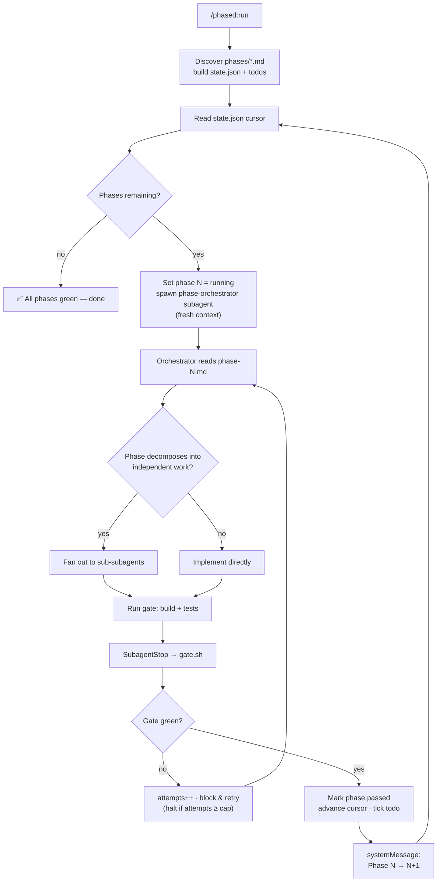
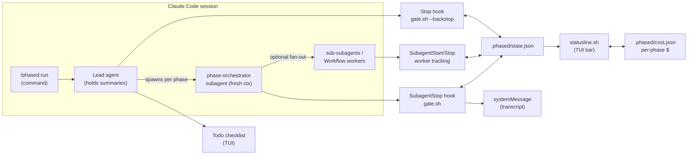

# phased

Break a big feature into phase documents, then let Claude implement them **in order, automatically**. Each phase runs in its own fresh subagent (so phase 1's forty file-reads never bloat phase 2's context), and no phase counts as done until your **build + tests actually pass**. Start it, walk away, come back to green.

## Install

You need [Claude Code](https://claude.com/claude-code) ≥ 2.1 and `jq` (`brew install jq` / `apt install jq`).

**Option A — try it for one session** (nothing installed):

```bash
git clone https://github.com/RaynLight/phased.git
claude --plugin-dir /path/to/phased
```

**Option B — install it properly** (persists across sessions; this repo doubles as its own marketplace):

```bash
claude plugin marketplace add RaynLight/phased    # or a local path
claude plugin install phased@phased
```

Then restart your session so the hooks register. Update later with `claude plugin update phased`.

**Verify it's wired up:**

1. `/phased:status` answers (with "no phased run here" in a fresh project).
2. `/hooks` lists the phased `SubagentStart` / `SubagentStop` / `Stop` entries.
3. Optional but recommended: enable the status bar (see [Watching progress](#watching-progress-in-the-tui)) for live workers and per-phase cost.

## Quick start

1. In your project, run `/phased:init my-feature` — creates `phases/phase-01.md` from the template below.
2. Write one markdown file per phase — `phase-01.md`, `phase-02.md`, … (zero-padded so they sort). Phases run strictly in file order and later phases can build on earlier ones, so each needs a clear **Definition of Done**. Mark batch-shaped phases with an optional `Mode: workflow` line.
3. Not a Go project? Set your gate first — e.g. `export PHASED_GATE="npm run build && npm test"` (see [Configuring the gate](#configuring-the-gate)).
4. `/phased:run` — then walk away. Each phase runs in its own fresh agent, the gate blocks anything that doesn't build and pass tests, and the board shows live progress, workers, and cost.
5. Come back to a ✓-per-phase summary. Interrupted or failed? `/phased:run` again — it resumes where it stopped and retries failed phases.

## How it works

The lead session loops over your phase docs in order. Each phase is handed to a fresh `phase-orchestrator` subagent, and every time that subagent tries to finish, a `SubagentStop` hook runs your build + test gate — **blocking the return until the gate is green**. Progress lives in `.phased/state.json`, written by the hook script, never by the model's self-assessment. Interrupted? `/phased:run` resumes where it left off.

Inside a phase, the orchestrator can deploy its own subagent workers when the work splits into independent pieces. For batch-shaped phases, add a `Mode: workflow` line to the phase doc: the **lead** then runs a true dynamic Workflow over the pieces (the Workflow tool only exists at the lead level — subagents can't host it) and hands the results to the orchestrator, which verifies, integrates, and faces the gate as usual. Either way, `SubagentStart`/`SubagentStop` hooks track the workers in `state.json`, so the status line shows what a phase is working on right now, and the list collapses automatically at each phase boundary.

Who does what:

- **Lead (the director)** — sequences phases, maintains the on-screen board, and carries short cross-phase summaries forward. It never reads your source and never implements — it stays cheap.
- **`phase-orchestrator` (one per phase, fresh context)** — a full Claude Code agent (inherits your session's model, effort, and entire toolset) that reads its phase doc, implements it, fans out workers when the work splits, and cannot return until the gate is green.
- **Workers** — disposable subagents or workflow agents, one independent piece each.
- **`gate.sh` (not an agent)** — deterministic shell run by hooks, and the only writer of phase verdicts. It cannot be talked out of a red build.

Everything on disk lives in `.phased/`: `state.json` (progress — the source of truth), `cost.json` (per-phase `$`, recorded by the statusline), `gate.log` (latest gate output), and `active` (run-in-progress sentinel). Delete the directory for a clean slate.





## Phase doc format

Optional: a `Mode: workflow` line right under the title marks the phase as a batch job — the lead runs its independent pieces through a real dynamic Workflow instead of leaving fan-out to the orchestrator.

```markdown
# Phase 1 — <short title>

## Goal
<what this phase delivers, in 1–3 sentences>

## Scope
- In scope: ...
- Out of scope: ...

## Steps
1. ...
2. ...

## Definition of Done
- [ ] `go build ./...` passes
- [ ] `go test ./...` passes
- [ ] <phase-specific acceptance checks>
```

## Watching progress in the TUI

Three native surfaces, no custom panel:

1. **Phase board** (primary, in-screen) — `/phased:run` maintains one task per phase and Claude Code renders it as a live checklist: completed phases show their final cost and attempts (`Phase 1: Word counting — $0.08 · 1 attempt`), the running phase shows its mode (`Phase 2/4: Analyzers — fan-out`), future phases queue below. While a phase fans out, the running phase's spinner line carries live progress (`String helpers — ⚙ 2/5 workers done`) and the orchestrator adds one indented `└ ⚙ <worker>` row per live worker (capped at 4 plus a `+k more queued` rollup — the widget truncates past ~5 rows), removing each the moment that worker returns — so the board always shows exactly what's running right now. In-phase activity also appears inline (`⚙ Phase 2 · worker up: general-purpose (2 active)`), and Claude Code's own agents pane (`←`) lists live agents natively. `/phased:status` prints the full dashboard (per-phase cost, attempts, current workers) on demand.
2. **Status line** (persistent bar) — a one-liner at the bottom of the terminal:

   ```
   phased ▓░░░░ 2/5 · API routes · running · ⚙2 general-purpose · $0.31 (run $1.12)
   ```

   One `▓` per passed phase. `⚙2 general-purpose` is the phase's live fan-out workers (subagents / Workflow agents) — they appear while running and collapse away when the phase passes. `$0.31 (run $1.12)` is the current phase's spend and the run total so far; each phase's final cost also lands in the transition message and `.phased/cost.json`. CLI/terminal only. This is **opt-in**: add to your `settings.json`:

   ```json
   { "statusLine": { "type": "command", "command": "${CLAUDE_PLUGIN_ROOT}/scripts/statusline.sh" } }
   ```

   If `${CLAUDE_PLUGIN_ROOT}` isn't expanded in your settings context, point at the script directly — e.g. `/path/to/phased/scripts/statusline.sh` for a local checkout, or copy `statusline.sh` into `~/.claude/` and reference it there.
3. **Transition messages** — the gate hook prints one line at each boundary: `✅ Phase 2 (API routes) passed build + tests → next: Phase 3 (Handlers)`.

You'll also see each phase's subagent spin up and return its summary, so the sequence visibly advances turn by turn. `/phased:status` prints the full picture on demand.

## Configuring the gate

Default gate: `go build ./... && go test ./...`. Override precedence:

1. `PHASED_GATE` environment variable, if set.
2. `gate` in `.phased/state.json` (seeded at run start; edit it any time).
3. The Go default.

Common alternatives:

| Stack  | Gate |
|--------|------|
| Node   | `npm run build && npm test` |
| Python | `ruff check . && pytest -q` |
| Rust   | `cargo build && cargo test` |

**Retries:** each phase gets `cap` gate attempts (default 6, edit `.phased/state.json`) before the run halts for manual review. The gate's output lands in `.phased/gate.log`.

## Commands

| Command | What it does |
|---------|--------------|
| `/phased:init [feature]` | Scaffold `phases/` with a template phase doc |
| `/phased:run` | Run (or resume) all phases in order, gated |
| `/phased:status` | Print per-phase progress |

## Troubleshooting

- **Statusline blank?** Check the script is executable (`chmod +x`), the path in `statusLine` is right, `jq` is installed, and there's a `.phased/state.json` in the project you're sitting in.
- **No `$` cost in the bar?** Cost tracking is fed by the statusline itself (that's the only place Claude Code exposes live session cost), so it only works with the statusline configured — and appears once the session has spent something.
- **Gate always failing?** Run the gate command by hand — it's your build/tests failing, not the plugin. Fix the command (`PHASED_GATE` or `gate` in `state.json`) if it's the wrong one for your stack.
- **Nothing happens on `/phased:run`?** You need a `phases/` directory with `phase-*.md` files — run `/phased:init`.
- **Hooks not firing?** Restart the session after installing the plugin, and check `/hooks` lists the phased `SubagentStop`/`Stop` entries. The gate also needs `jq` (`brew install jq`).
- **Want a clean slate?** `rm -rf .phased` and run `/phased:run` again — state and sentinel both live there.
